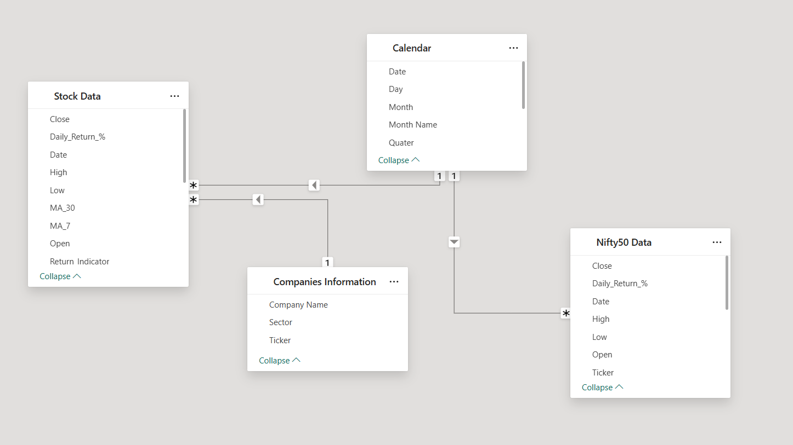
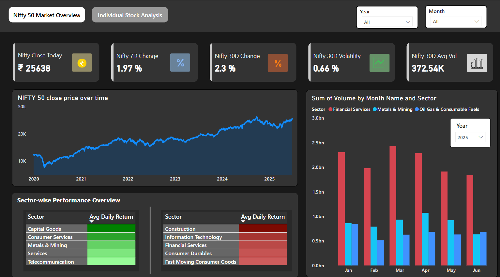
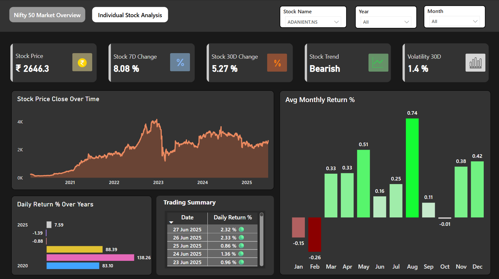

# Nifty 50 Market & Stock Analysis Dashboard (2020–2025)


---

## Project Overview

A complete end-to-end **data analytics pipeline project** focused on the Indian stock market, specifically the **Nifty 50 index** and its constituent stocks from **January 2020 to June 2025**.

This project showcases my ability to:

- Collect and engineer **financial market data**
- Store it in a **relational database (MySQL)**
- Design and deliver impactful **dashboards in Power BI**
- Generate **insightful observations** and patterns for strategic decision-making

---

## Executive Summary

The Nifty 50 Market Analysis Dashboard helps users understand:

- **Index-level performance and trends**
- **Sector-level insights based on volume and returns**
- **Stock-level technical and statistical behavior**
- **Volatility, trend patterns, and seasonality** across 5 years of data

The analysis is powered by:

- 📦 Python (data collection + feature engineering)
- 🗃️ MySQL (data warehousing)
- 🧠 DAX (custom KPIs)
- 📊 Power BI (dashboards with filters & interactivity)

---

## Project Structure

```
nifty50-market-analysis-powerbi/
├── data/ # Sample/processed data
├── scripts/ # Python scripts (fetch, process)
├── SQL-Ingestion-scripts/ (MySQL load)
├── dashboards/ # Power BI .pbix file & screenshots
├── docs/ # NSE docs, references
├── README.md # This file
└── requirements.txt # Python dependencies
```
---

## Tools & Technologies Used

| Tool        | Purpose                          |
|-------------|----------------------------------|
| `yfinance`  | Extract Nifty & Stock Data       |
| `pandas`    | Feature Engineering (MA_7, MA_30)|
| `MySQL`     | Data Storage                     |
| `Power BI`  | Dashboard Design                 |
| `DAX`       | Custom Metrics & Logic           |

---

### Data Modeling: Star Schema Implementation

The dashboard is powered by a well-designed **Star Schema**, ensuring optimized query performance and clean data relationships. It includes:

- A **Fact Table** for daily Nifty & stock metrics
- **Dimension Tables** such as:
  - Calendar (Date)
  - Companies Info
  - Stock Metadata
  - Nifty 50 data

This model enables seamless filtering across time, sector, and stock levels in Power BI.

📸 


---

## Key Features

### Sheet 1: Nifty 50 Market Overview

- **KPIs**: Today’s Close, 7D & 30D Change %, 30D Volatility, Avg Volume
- **Charts**:
  - Nifty Closing Price (Area Chart)
  - Top/Bottom 5 Performing Sectors by Daily Return
  - Sector-wise Volume Analysis
- **Filters**: Year, Month

📸 

---

### Sheet 2: Individual Stock Analysis

- **KPIs**: Current Price, Trend (Bullish/Bearish), Volatility
- **Charts**:
  - Stock Price over Time
  - Daily Return % by Year
  - Monthly Avg Return
  - Trading Summary with 🟢/🔴 symbols (via DAX)
- **Filters**: Stock Name, Year, Month

📸 

---

## Key Insights & Observations

### 📌 Market-Level
1. **Top Volume Sectors**: Financial Services, Metal & Mining, Oil & Consumables — consistent across 4/5 years.
2. **7D vs 30D % Change**: Strong similarity in trends.
3. **Top 2025 Performers**: Capital Goods, Telecom, Financial Services.
4. **Consistent Positive Returns**: Metal & Mining appeared in top-5 consistently.

### 📌 Stock-Level
- All 50 stocks analyzed with trend and volatility filters.
- Individual summaries generated with emoji markers via DAX.
- Too broad to summarize stock-by-stock without automation (scope for ML/NLP).

---

## 🔮 Future Roadmap

- 🔁 Automate Power BI refresh using Python + Gateway (Using AirFlow)
- 📈 Add ML-based stock cluster analysis (based on trend/volatility)
- 🗣️ Generate auto-summaries for stocks using NLP
- ☁️ Deploy dashboard to Power BI Service with user controls

---

## 👨‍💻 About Me

**Prateek Kumar Prasad**  
🎓 B.Tech Data Science | 3rd Year  
📊 Data Scientist & Analyst
📧 prateekkumarprasad15@gmail.com  
🔗 [LinkedIn](https://www.linkedin.com/in/prateekkp/)

---

> *"Just like a fighter jet tracks every signal, this dashboard tracks every market pulse."* 🇮🇳
